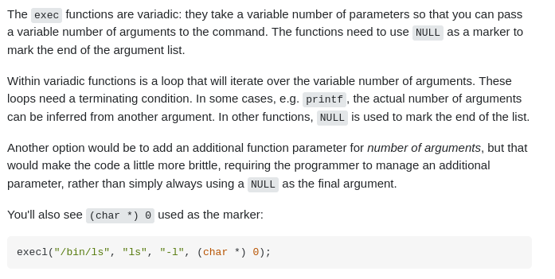

# emb52: stdin redirection on a python application, cat | script\#

.png>)

.png>)

with errors

.png>)

while here is more canonical way

But it does not work. suggested solution was writing p1.sendline() before the p2=process()
